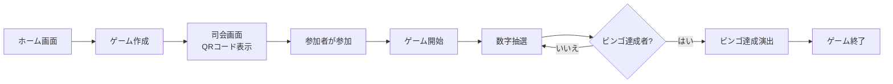

# ビンゴアプリ

結婚式二次会やイベントで使えるリアルタイムビンゴ大会アプリケーションです。

## 🎯 特徴

- **ログイン不要**: 参加者はURLまたはQRコードをスキャンするだけで即参加
- **リアルタイム同期**: WebSocketによる遅延のない数字抽選とビンゴ判定
- **マルチデバイス対応**: PC、タブレット、スマートフォンで最適な表示
- **高級感のあるデザイン**: "Midnight Gala"テーマによる洗練されたUIと演出

## 📋 システム要件

| 役割 | 推奨デバイス | 用途 |
|------|-------------|------|
| **管理者 (Admin)** | PC、タブレット | ゲーム設定、参加者管理、ゲーム制御 |
   - 「新しいゲームを作成」をクリック

2. **司会画面 (Host)** (`http://localhost:3000/host`)
   - QRコードと参加用URLが表示されます
   - このQRコードをプロジェクターで投影、または参加者に共有
   - 「ゲーム開始」ボタンでゲームスタート
   - 「抽選」ボタンで数字を1つずつ引く
   - 抽選された数字と履歴が大きく表示されます
   - リーチ人数・ビンゴ人数がリアルタイムで表示されます

#### 参加者側の操作

1. **QRコードまたはURLで参加**
   - 司会画面に表示されたQRコードをスマホで読み取る、またはURLに直接アクセス (`http://localhost:3000/play/{roomId}`)

2. **名前を入力して参加**
   - ニックネームを入力（アカウント登録不要）
   - 自動的にビンゴカード（5x5、中央FREE）が生成されます

3. **ゲームプレイ**
   - 司会者が抽選した数字が自分のカードにあれば、その数字をタップ
   - タップすると「穴が開く」アニメーション
   - リーチ（あと1つでビンゴ）になると「リーチ！」の演出
   - ビンゴ達成時は「ビンゴ！」の大きな演出が表示されます

## 🎮 使い方詳細

### ゲームフロー

### 司会画面の機能

**QRコード表示エリア**
- 参加者がスキャンするためのQRコードと参加URL
- 参加者はこのQRコードを読み取るだけで即ゲーム参加可能

**抽選機能**
- 「抽選」ボタンをクリックして数字を1つ引く
- ドラムロールのようなアニメーション演出
- 抽選された数字が大きく表示

**履歴表示**
- これまでに抽選された数字の一覧
- 視覚的に分かりやすく整理

**状況パネル**
- 現在の参加者数
- リーチ人数（あと1つでビンゴの参加者）
- ビンゴ達成者数と名前
- ビンゴ達成時は祝福アラート表示

### 参加者画面の機能

**ビンゴカード**
- 自動生成される5x5のカード（中央はFREE）
- 抽選された数字がハイライト表示
- タップで穴あけ（抽選済みの数字のみ）

**リーチ・ビンゴ演出**
- リーチ達成時: 画面に「リーチ！」と表示
- ビンゴ達成時: 花火や紙吹雪の派手な演出

**再接続機能**
- ブラウザを閉じてもLocalStorageで状態保存
- 同じURLに再アクセスすれば、進行中のゲームに復帰可能

## 🔧 トラブルシューティング

### よくある問題

**Q: 参加者が接続できない**
- フロントエンドとバックエンドの両方が起動しているか確認してください
- ブラウザのコンソールでエラーが出ていないか確認
- ネットワーク設定でポート3000と3001がブロックされていないか確認

**Q: 数字を引いても参加者側に反映されない**
- WebSocket接続が確立されているか確認
- バックエンドのログで接続状態を確認
- ページをリロードして再接続を試してください

**Q: ビンゴ判定がおかしい**
- 参加者がすべての該当する数字を正しくタップしているか確認
- ブラウザの開発者ツールでカードの状態を確認

**Q: QRコードが表示されない**
- `react-qr-code`パッケージがインストールされているか確認: `npm install react-qr-code`
- ルームIDが正しく生成されているか確認

## 🚀 デプロイメント

### 本番環境へのデプロイ

このアプリケーションはAWSにデプロイできます:

- **Frontend**: AWS Amplify
- **Backend**: AWS App Runner

詳細な手順は [デプロイメントガイド](./docs/deployment.md) を参照してください。

### ブランチ戦略

- **`main`ブランチ**: 本番環境（自動デプロイ）
- **`develop`ブランチ**: 開発環境（ローカル）

開発は`develop`ブランチで行い、`main`へのマージで本番環境に自動デプロイされます。

## 📚 技術スタック

- **Frontend**: Next.js 16 + React 19 + Tailwind CSS 4 + TypeScript
- **Backend**: NestJS 11 + Socket.io + TypeScript
- **Infrastructure**: AWS Amplify (予定)
- **Real-time Communication**: WebSocket (Socket.io)

詳細な開発者向けドキュメントは [docs/development.md](./docs/development.md) を参照してください。

## 📖 関連ドキュメント

- [要件定義書](./docs/requirements.md) - アプリケーションの詳細仕様
- [API設計](./docs/api_design.md) - WebSocketイベントとデータ構造
- [開発者ガイド](./docs/development.md) - 開発環境セットアップと貢献方法
- [アーキテクチャ](./docs/architecture.md) - システム設計の詳細

## 📝 ライセンス

このプロジェクトはプライベート利用を想定しています。

---

**サポートが必要な場合**: [GitHubのIssues](https://github.com/your-repo/issues)で質問してください。
