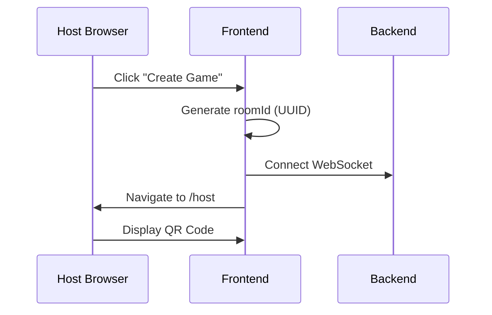
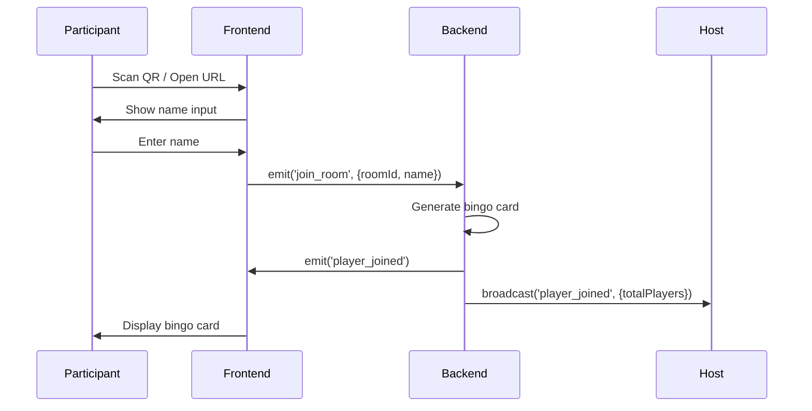
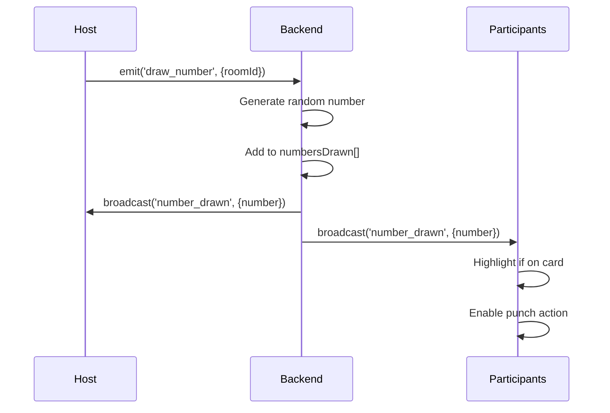
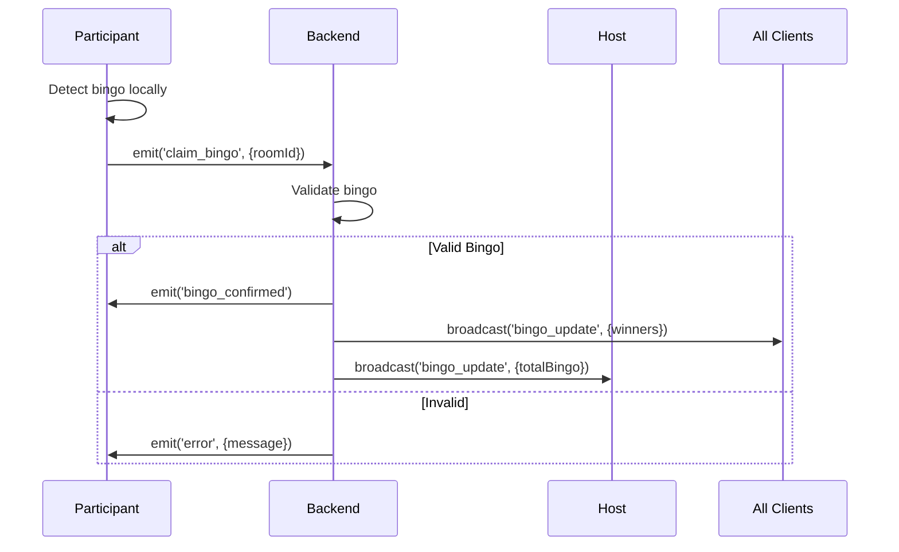
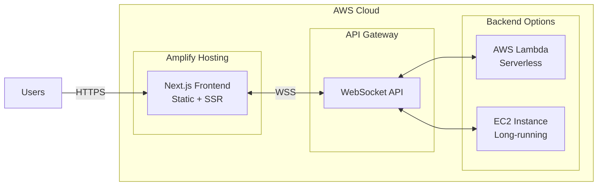

# System Architecture

This document describes the technical architecture of the Bingo application.

## High-Level Architecture

```mermaid
graph TB
    subgraph Client["Client Layer"]
        Host[Host Screen<br/>PC/Projector]
        Participant[Participant Screen<br/>Smartphone]
    end
    
    subgraph Frontend["Frontend - Next.js"]
        HostPage[/host page]
        PlayPage[/play/[roomId] page]
        HomePage[/ home page]
        SocketClient[Socket.io Client]
    end
    
    subgraph Backend["Backend - NestJS"]
        Gateway[WebSocket Gateway]
        GameService[Game Service]
        RoomManager[Room Manager]
    end
    
    subgraph Storage["In-Memory Storage"]
        Rooms[(Rooms State)]
        Players[(Players State)]
    end
    
    Host -->|HTTP/WebSocket| HostPage
    Participant -->|HTTP/WebSocket| PlayPage
    HostPage --> SocketClient
    PlayPage --> SocketClient
    HomePage -->|Create Room| HostPage
    
    SocketClient <-->|WebSocket Events| Gateway
    Gateway --> GameService
    GameService --> RoomManager
    RoomManager <--> Rooms
    RoomManager <--> Players
    
    Gateway -.->|Broadcast| SocketClient
```

## Component Description

### Frontend Components

#### 1. Home Page (`/`)
- **Purpose**: Entry point for creating new game rooms
- **URL**: `http://localhost:3000`
- **Features**:
  - "Create New Game" button
  - Redirects to `/host` with generated room ID

#### 2. Host Page (`/host`)
- **Purpose**: Main control screen for game hosts (projected to large screen)
- **URL**: `http://localhost:3000/host`
- **Key Features**:
  - **QR Code Display**: Generates QR code with participant URL
  - **Lottery Drawing**: Button to draw random numbers with animation
  - **Number History**: Display all drawn numbers
  - **Statistics Panel**: Real-time count of participants, reach, and bingo
  - **Game Controls**: Start, pause, reset buttons
- **State Management**:
  - Connected via Socket.io to backend
  - Listens for `player_joined`, `reach_update`, `bingo_update` events
  - Emits `draw_number`, `start_game` events

#### 3. Play Page (`/play/[roomId]`)
- **Purpose**: Participant's bingo card interface (smartphone)
- **URL**: `http://localhost:3000/play/{roomId}`
- **Key Features**:
  - **Name Entry**: Simple nickname input (no authentication)
  - **Bingo Card**: Auto-generated 5x5 grid (center is FREE)
  - **Interactive Tiles**: Tap to punch numbers
  - **Animations**: 
    - Punch animation with particle effects
    - "REACH!" alert when one away from bingo
    - "BINGO!" celebration with confetti
  - **Persistence**: LocalStorage saves participant ID for reconnection
- **State Management**:
  - Socket.io connection to backend
  - Listens for `number_drawn`, `game_started` events
  - Emits `join_room`, `punch_card`, `claim_bingo` events

### Backend Components

#### 1. WebSocket Gateway (`game.gateway.ts`)
- **Purpose**: Handle real-time communication with clients
- **Technology**: Socket.io (@nestjs/websockets)
- **Responsibilities**:
  - Accept WebSocket connections
  - Route events to Game Service
  - Broadcast game updates to all connected clients
  - Manage room-based channels

**Key Events Handled**:
| Event | Direction | Purpose |
|-------|-----------|---------|
| `join_room` | Client → Server | Participant joins game |
| `draw_number` | Client → Server | Host draws a number |
| `punch_card` | Client → Server | Participant punches number |
| `claim_bingo` | Client → Server | Participant claims bingo |
| `number_drawn` | Server → Client | Broadcast new number |
| `player_joined` | Server → Client | Notify new participant |
| `bingo_update` | Server → Client | Broadcast bingo winner |

#### 2. Game Service (`game.service.ts`)
- **Purpose**: Core game logic and rules
- **Responsibilities**:
  - Generate unique room IDs
  - Create randomized 5x5 bingo cards
  - Draw random numbers (1-75, no duplicates)
  - Validate bingo claims (check lines: horizontal, vertical, diagonal)
  - Calculate reach status (one number away from bingo)

**Key Methods**:
- `createRoom()`: Initialize new game room
- `generateCard()`: Create unique 5x5 bingo card with FREE center
- `drawNumber(roomId)`: Draw random unused number for room
- `validateBingo(card, drawnNumbers)`: Check if card has valid bingo
- `calculateReach(card, drawnNumbers)`: Determine if card is in reach state

#### 3. Room Manager
- **Purpose**: Manage game state in memory
- **Data Structure**:
```typescript
interface Room {
  roomId: string;
  status: 'WAITING' | 'PLAYING' | 'ENDED';
  numbersDrawn: number[];
  createdAt: Date;
}

interface Player {
  id: string;
  roomId: string;
  name: string;
  card: number[][];  // 5x5 matrix
  punchedNumbers: number[];
  isReach: boolean;
  isBingo: boolean;
  socketId: string;
}
```

## Data Flow

### Game Creation Flow


### Participant Join Flow


### Number Drawing Flow


### Bingo Claim Flow


## Design System: "Midnight Gala" Theme

### Color Palette
```css
--color-base-navy: #0a0a1a;
--color-base-black: #000000;
--color-accent-gold: #ffd700;
--color-accent-pink: #ff007f;
--color-accent-cyan: #00ffff;
--color-text-white: #ffffff;
--color-text-offwhite: #f5f5f5;
```

### Visual Effects
- **Glassmorphism**: Frosted glass effect with backdrop blur
- **Gradients**: Subtle color transitions for depth
- **Glow Effects**: Neon-style glow on accent elements

### Animation Specifications

**Number Drawing**:
- Type: Drum roll / slot machine effect
- Duration: 2-3 seconds
- Easing: Ease-out with bounce
- Library: Framer Motion

**Card Punch**:
- Type: Particle burst
- Duration: 0.5 seconds
- Effect: Tiles flip with scale transform
- Library: Framer Motion + custom CSS

**Bingo/Reach**:
- Type: Screen-wide celebration
- Bingo: Confetti explosion (canvas-confetti)
- Reach: Glowing pulse animation
- Duration: 3-5 seconds

## Real-Time Communication

### WebSocket Configuration

**Client (Frontend)**:
```typescript
import { io } from 'socket.io-client';

const socket = io('http://localhost:3001', {
  transports: ['websocket'],
  reconnection: true,
  reconnectionAttempts: 5,
  reconnectionDelay: 1000
});
```

**Server (Backend)**:
```typescript
@WebSocketGateway({
  cors: {
    origin: 'http://localhost:3000',
    credentials: true
  }
})
```

### Room-Based Broadcasting
- Each game has unique `roomId`
- Clients join Socket.io room: `socket.join(roomId)`
- Events broadcast to room: `server.to(roomId).emit('event', data)`

### Reconnection Strategy
1. Frontend stores participant ID in `localStorage`
2. On reconnection, rejoin room with stored ID
3. Backend validates and restores player state
4. Re-sync game state to client

## State Management

### Frontend (React)
- **useState**: Component-local state (UI interactions)
- **useEffect**: WebSocket event listeners
- **localStorage**: Persistent participant ID and name

### Backend (NestJS)
- **In-Memory Maps**: `Map<roomId, Room>` and `Map<playerId, Player>`
- **No Database**: Current implementation uses volatile storage
- **Future**: Consider Redis for scalability and persistence

## Security Considerations

### Current Implementation
- No authentication required for participants (by design)
- Room IDs are UUIDs (hard to guess)
- Host controls game flow (draw, start, end)

### Potential Enhancements
- Admin password protection
- Rate limiting on WebSocket events
- Input validation and sanitization
- HTTPS/WSS in production

## Deployment Architecture (Planned)

### AWS Amplify Hosting



**Deployment Considerations**:
- **Frontend**: Deploy to Amplify with SSR support
- **Backend**: 
  - Option 1: AWS Lambda (requires stateless design or DynamoDB)
  - Option 2: EC2 with persistent WebSocket connections
- **WebSocket**: API Gateway WebSocket API or ALB with WebSocket support

## Performance Optimization

### Frontend
- Code splitting for routes
- Lazy load heavy components (confetti, animations)
- Optimize image assets
- Debounce frequent events (punch card)

### Backend
- Efficient broadcasting (room-based, not global)
- Limit number of players per room (e.g., 100 max)
- Clean up disconnected players
- Use connection pooling if database added

## Monitoring and Debugging

### Development Tools
- **Frontend**: React DevTools, Network tab (WS)
- **Backend**: NestJS Logger, Socket.io admin UI
- **Both**: Console logging with structured format

### Production Monitoring (Future)
- CloudWatch for AWS services
- Socket.io connection metrics
- Error tracking (e.g., Sentry)
- Performance monitoring (e.g., New Relic)

## Future Enhancements

### Planned Features
- [ ] Persistent storage with database (PostgreSQL/DynamoDB)
- [ ] Multiple bingo patterns (L-shape, X-shape, etc.)
- [ ] Customizable card size (3x3, 4x4, 5x5)
- [ ] Admin dashboard with analytics
- [ ] Mobile app (React Native)
- [ ] Voice announcements for accessibility
- [ ] Multi-language support

### Scalability Roadmap
- Horizontal scaling with Redis for shared state
- Load balancer for multiple backend instances
- CDN for static assets
- Database read replicas for heavy read operations

---

For more details, refer to:
- [Requirements](./requirements.md)
- [API Design](./api_design.md)
- [Development Guide](./development.md)
