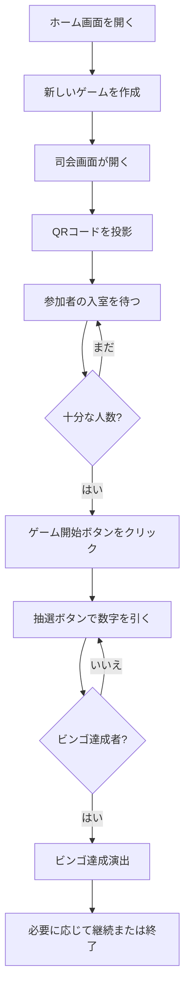

# 司会者向け操作マニュアル

## 📋 はじめに

### このマニュアルについて
このマニュアルは、イベントや結婚式二次会などでビンゴ大会を実施する**司会者（Host）**の方を対象とした操作ガイドです。
アプリケーションの起動から、ゲーム運営、トラブル対応まで、実際の運用手順に沿って説明します。

### 司会者の役割
司会者画面の主な役割は以下の通りです：
- 参加者が入室するためのQRコードとURLを表示
- ビンゴの数字を抽選（ドラムロール演出）
- 抽選結果と履歴を大画面で表示
- 参加者数、リーチ人数、ビンゴ達成者をリアルタイムで確認
- ゲーム全体の進行管理

> **✨ 新機能**: 「Midnight Gala」テーマを採用し、より華やかで没入感のある演出が追加されました。また、不正防止のための自動バリデーション機能も搭載されています。

---

## 🚀 イベント前の準備

### 1. システム要件の確認

**推奨環境**:
- **デバイス**: PC（プロジェクターやスクリーンに投影することを想定）
- **ブラウザ**: Google Chrome、Microsoft Edge、Safari（最新版）
- **インターネット**: 安定したWi-Fi環境（参加者も利用できること）
- **画面**: できるだけ大きなディスプレイまたはプロジェクター

### 2. アプリケーション起動手順

#### ステップ1: バックエンドサーバーの起動
```bash
# 管理者または技術スタッフが実施
cd packages/backend
npm run start:dev
```
✅ サーバーが `http://localhost:3001` で稼働していることを確認

#### ステップ2: フロントエンドアプリの起動
```bash
# 同じく管理者または技術スタッフが実施
cd packages/frontend
npm run dev
```
✅ アプリが `http://localhost:3000` で稼働していることを確認

> **ヒント**: 通常、これらの起動作業は技術担当者が事前に完了しています。司会者は起動済みのアプリにブラウザでアクセスするだけでOKです。

### 3. 接続確認

ブラウザで `http://localhost:3000` にアクセスし、ホーム画面が表示されることを確認してください。

### 4. テスト実施（推奨）

イベント本番前に、以下のテストを実施することをお勧めします：
- ゲームルーム作成
- 自分のスマホで参加者として参加してみる
- 数字を数回抽選してみる
- プロジェクターに正しく投影されるか確認

---

## 🎮 ゲーム運営の流れ

### 全体フロー



---

## 📺 司会画面の操作ガイド

### ゲームルームの作成

**手順**:
1. ブラウザで `http://localhost:3000` にアクセス
2. ホーム画面で **「新しいゲームを作成」** ボタンをクリック
3. 自動的に司会画面（`/host`）に遷移します

> **自動処理**: ルームIDは自動的に生成されます。特別な設定は不要です。

### 司会画面のレイアウト

司会画面は以下のエリアで構成されています：

```
┌─────────────────────────────────────────────────────┐
│  [QRコード表示エリア]  │  [ゲーム状態パネル]     │
│   参加用QRコード      │   ・参加者数             │
│   参加用URL           │   ・リーチ人数           │
│                        │   ・ビンゴ達成者         │
├─────────────────────────────────────────────────────┤
│            [抽選ボタン]                             │
│       「抽選」または「数字を引く」                  │
├─────────────────────────────────────────────────────┤
│          [抽選結果表示エリア]                       │
│        現在引いた数字が大きく表示                   │
├─────────────────────────────────────────────────────┤
│          [抽選履歴パネル]                           │
│       これまでに引いた数字の一覧                    │
└─────────────────────────────────────────────────────┘
```

### 1. QRコードの表示と参加者募集

**やること**:
- 司会画面が開くと、画面左上または中央にQRコードが表示されます
- このQRコードをプロジェクターで大きく投影してください
- QRコードの下に参加用URLも表示されているので、参加者に伝えることも可能です

**参加者への案内例**:
> 「それでは、ビンゴゲームを始めます！スマートフォンのカメラでこちらのQRコードを読み取ってください。自動的に参加画面が開きます。ニックネームを入力して参加してくださいね！」

**確認事項**:
- 画面右側の「参加者数」が増えていくのをリアルタイムで確認できます
- 参加者が順調に増えているか目視確認してください

### 2. ゲーム開始

**タイミング**:
- 十分な参加者が集まったら（イベントの規模に応じて判断）
- または、イベントスケジュールの開始時刻になったら

**手順**:
1. 画面上の **「ゲーム開始」** ボタンをクリック
2. ゲームステータスが「待機中」から「プレイ中」に変わります
3. 参加者の画面にも「ゲーム開始」の通知が届きます

> **注意**: ゲーム開始後も参加者の途中参加は可能ですが、遅れて参加した人は不利になる可能性があります。

### 3. 数字の抽選

**手順**:
1. **「抽選」** または **「数字を引く」** ボタンをクリック
2. ドラムロールのようなアニメーション演出が開始されます（2〜3秒）
3. ランダムに選ばれた数字が大きく表示されます
4. 抽選された数字は自動的に全参加者の画面に送信されます

**進行のコツ**:
- 抽選アニメーション中に盛り上げのアナウンスを入れると効果的です
  - 例: 「次の番号は……？」「さぁ、何番が出るでしょうか！」
- 数字が表示されたら、はっきりと読み上げましょう
  - 例: 「出ました！42番です！4・2番！」
- 次の数字を引くまで、少し間を取ると参加者が確認しやすくなります（5〜10秒程度）

**抽選のペース**:
- 推奨: 10〜15秒に1回のペース
- イベントの雰囲気や参加者の反応を見ながら調整してください
- リーチが増えてきたら、ペースを少し落として緊張感を高めるのも良いでしょう

### 4. 抽選履歴の確認

**表示内容**:
- これまでに抽選されたすべての数字が時系列で表示されます
- 通常、新しい数字が上または左に追加されます

**活用方法**:
- 参加者から「今までどの数字が出ましたか？」と聞かれた際の参照用
- 重複がないかの確認（システムは自動的に重複を防ぎますが、目視確認も可能）

### 5. リーチ・ビンゴ状況の確認

**リーチ表示**:
- 画面右側の「リーチ人数」パネルに、現在リーチ状態の参加者数が表示されます
- リーチ = あと1つの数字でビンゴが揃う状態

**司会者のアナウンス例**:
> 「おや！リーチの方が〇〇人に増えました！次の数字で誰かビンゴになるかもしれませんね！」

**ビンゴ達成時**:
- ビンゴを達成した参加者が出ると、画面に大きなアラート表示が出ます
- 「ビンゴ達成者」パネルに、達成者の名前（ニックネーム）と人数が表示されます
- 参加者側の画面でも大きな「BINGO!」演出（花火・紙吹雪）が表示されます

> **🔒 セキュリティ**: システムは参加者のビンゴ達成を自動的に検証します。不正なビンゴ宣言（まだ出ていない数字での宣言など）はシステム側でブロックされますので、司会者は安心して進行できます。

**司会者のアナウンス例**:
> 「ビンゴです！◯◯さん、おめでとうございます！前に出てきていただけますか？」

### 6. ゲームの継続と終了

**1位が決まった後の継続**:
- イベントによっては、2位、3位も決めることがあります
- その場合、そのまま抽選を続けてください
- 次にビンゴを達成した人が2位、その次が3位となります

**ゲーム終了**:
- すべての賞品が渡し終わったら、ゲームを終了します
- 「ゲーム終了」ボタン（実装されている場合）をクリック
- または、ブラウザを閉じるだけでもOKです

---

## 💡 よくあるシナリオ

### シナリオ1: 参加者がなかなか入室しない

**考えられる原因**:
- QRコードが見えにくい（小さい、ピントが合っていない）
- Wi-Fiが不安定、または参加者がWi-Fiに接続していない
- 参加方法が理解されていない

**対処法**:
1. QRコードを拡大表示してみる
2. 参加用URLを口頭で伝える（短いURLの場合）
3. Wi-Fi接続方法を再度案内する
4. 技術スタッフに確認を依頼

### シナリオ2: 抽選ボタンを押しても数字が出ない

**考えられる原因**:
- ネットワーク接続が切れている
- バックエンドサーバーが停止している

**対処法**:
1. ブラウザのネットワーク接続を確認
2. ページをリロード（F5キー）してみる
3. 技術スタッフに連絡して、バックエンドサーバーの状態を確認してもらう

### シナリオ3: ビンゴ達成者がいるはずなのに表示されない

**考えられる原因**:
- 参加者がまだ「ビンゴ！」ボタンを押していない（自動検出でない場合）
- 参加者側の接続が切れている

**対処法**:
1. 参加者に再度確認してもらう
2. 参加者に画面をリロードしてもらう
3. 最悪の場合、手動で確認して賞品を渡す

### シナリオ4: ゲームを途中でやり直したい

**手順**:
1. 現在のゲームを終了（ブラウザを閉じる）
2. ホーム画面から新しいゲームを作成
3. 参加者には新しいQRコードをスキャンしてもらう

> **注意**: 進行中のゲーム状態は引き継がれません。新しいビンゴカードが生成されます。

---

## 🔧 トラブルシューティング

### 問題: QRコードが表示されない

**チェックリスト**:
- [ ] フロントエンドアプリが起動しているか
- [ ] ブラウザのJavaScriptが有効になっているか
- [ ] `react-qr-code` パッケージがインストールされているか（技術スタッフに確認）

**解決手順**:
1. ページをリロード（F5キー）
2. 別のブラウザで試してみる
3. 技術スタッフに連絡

### 問題: 参加者が接続できない

**チェックリスト**:
- [ ] バックエンドサーバーが起動しているか
- [ ] フロントエンドアプリが起動しているか
- [ ] 参加者のスマホがWi-Fiに接続されているか
- [ ] 同じネットワーク内にいるか（ローカル開発の場合）

**解決手順**:
1. 自分のスマホで参加画面を開いてみる（テスト）
2. Wi-Fi接続状態を確認
3. 技術スタッフに連絡してサーバー状態を確認

### 問題: 抽選結果が参加者に届かない

**症状**:
- 司会画面では数字が引けるが、参加者側に反映されない

**原因**:
- WebSocket接続が切れている

**解決手順**:
1. 参加者に画面をリロードしてもらう
2. 技術スタッフにWebSocket接続状態を確認してもらう
3. 必要に応じてサーバーを再起動

### 問題: 画面が固まった、動かない

**解決手順**:
1. ブラウザの他のタブを閉じてみる（メモリ不足の可能性）
2. ページをリロード（F5キー）
3. ブラウザを再起動
4. それでもダメなら技術スタッフに連絡

---

## ✅ 当日運営クイックチェックリスト

イベント当日、このチェックリストを使ってスムーズに進行しましょう。

### イベント開始前（30分前）
- [ ] PCとプロジェクターの接続確認
- [ ] アプリケーション起動確認（技術スタッフと連携）
- [ ] ホーム画面が正常に表示されるか確認
- [ ] テスト用ゲームで動作確認（5分程度）
- [ ] Wi-Fi接続の確認（参加者用ネットワーク）
- [ ] 賞品の準備と配置確認

### イベント開始時
- [ ] 新しいゲームルームを作成
- [ ] QRコードがプロジェクターで見やすく表示されているか確認
- [ ] 参加方法をアナウンス
- [ ] 参加者数を確認しながら待機
- [ ] 十分な参加者が集まったら「ゲーム開始」

### ゲーム進行中
- [ ] 適切なペースで抽選を実施（10〜15秒に1回）
- [ ] 抽選された数字をはっきりと読み上げる
- [ ] リーチ人数の増加を参加者に伝える
- [ ] ビンゴ達成者が出たら、すぐに名前を確認して呼ぶ
- [ ] 賞品を手渡し、拍手で祝福

### ゲーム終了時
- [ ] 全賞品が渡されたことを確認
- [ ] 参加者への感謝の言葉
- [ ] ゲームを終了またはブラウザを閉じる

---

## 🎯 スムーズなイベント運営のコツ

### 1. プロジェクター設定
- **明るさ**: 会場照明を少し落として、プロジェクターがはっきり見えるようにする
- **位置**: QRコードが参加者全員から見やすい位置に投影
- **フォーカス**: QRコードがぼやけていると読み取れないので、しっかりピント調整

### 2. アナウンスのポイント
- **明瞭に**: 数字は大きな声ではっきりと
- **繰り返す**: 「42番です！4・2番！」のように2回言うと親切
- **間を取る**: 参加者が確認する時間を与える（5〜10秒）
- **盛り上げる**: リーチが増えたら緊張感を高めるアナウンス

### 3. ペース配分
- **序盤**: やや速めでテンポよく（リーチが少ない間）
- **中盤**: 標準ペース（10〜15秒に1回）
- **終盤**: リーチが増えたら少しゆっくり（緊張感を高める）

### 4. 参加者とのコミュニケーション
- 「リーチの方、手を挙げてください！」など、インタラクティブに
- ビンゴ達成者には前に出てきてもらい、一緒に喜ぶ
- 盛り上がるような声かけを心がける

### 5. トラブル発生時の対応
- 落ち着いて、技術スタッフと連携
- 参加者には状況を正直に伝え、待ってもらう
- 最悪の場合、手動での進行も検討（紙のカードなど）

---

## 📞 緊急連絡先

トラブル発生時は、以下の担当者に連絡してください：

- **技術サポート担当**: [名前・連絡先を記入]
- **イベント責任者**: [名前・連絡先を記入]

---

## 📚 関連資料

- [アプリケーション全体マニュアル](../../README.md) - 管理者向け全体ガイド
- [要件定義書](../requirements.md) - アプリの仕様詳細
- [開発者ガイド](../development.md) - 技術的な詳細情報

---

**最終更新**: 2025年11月

このマニュアルについてのご質問やフィードバックは、技術チームまでお寄せください。
素晴らしいビンゴイベントを楽しんでください！🎉
