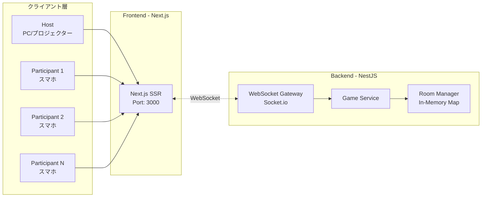
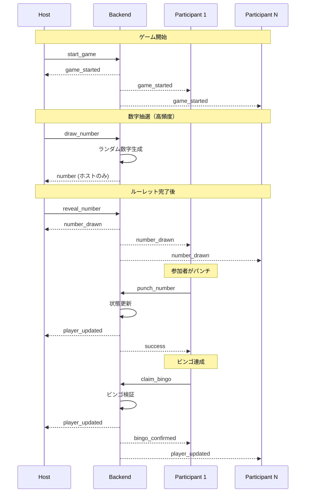

# 負荷テスト計画書

**対象システム**: ビンゴアプリ (Bingo App)  
**作成日**: 2025-11-28  
**ステータス**: 計画  
**関連Issue**: [#23 - 負荷テストを実施する必要あり](https://github.com/yutaro-shirai/bingo-app-by-gemini/issues/23)

---

## 1. 目的

本番運用前に、ビンゴアプリケーションの性能特性を把握し、想定される負荷に耐えられることを検証する。特に以下の点を確認する：

1. **WebSocket接続の安定性**: 同時接続ユーザー数に対する接続安定性
2. **リアルタイム通信のレイテンシ**: イベントブロードキャストの遅延時間
3. **スケーラビリティ**: システムが処理できる最大同時接続数と参加者数
4. **エラーリカバリー**: 高負荷時のエラー発生率と復旧能力

---

## 2. 現在のアーキテクチャ分析

### 2.1 システム構成



### 2.2 ボトルネック分析

#### 🔴 Critical Bottlenecks

1. **In-Memory State Management** (`Map<roomId, Room>`)
   - **現状**: すべてのルーム・プレイヤー状態をメモリ内Map管理
   - **リスク**: サーバー再起動でデータ消失、水平スケーリング不可
   - **影響**: 単一インスタンスの物理メモリ制約

2. **Single Backend Instance**
   - **現状**: 単一NestJSインスタンスですべてのWebSocket接続を処理
   - **リスク**: CPU・メモリ・ネットワーク帯域の上限到達
   - **影響**: 最大同時接続数の制限

3. **Socket.io Broadcasting**
   - **現状**: `server.to(roomId).emit()` によるルーム単位ブロードキャスト
   - **リスク**: 1ルームの参加者数 × イベント頻度でネットワーク負荷増加
   - **影響**: 数字抽選時の全参加者への同時配信遅延

#### 🟡 Secondary Bottlenecks

4. **Frontend SSR**
   - **現状**: Next.js SSRモード
   - **リスク**: 高トラフィック時のSSRレンダリング負荷
   - **影響**: 初回ページロード時間の増加

5. **ビンゴ判定ロジック**
   - **現状**: `checkBingo()` メソッドで全ライン走査（O(n)）
   - **リスク**: 参加者数増加に伴う計算負荷
   - **影響**: `claim_bingo` イベント処理時間

### 2.3 WebSocket接続パターン

#### イベントフロー



#### イベント頻度分析

| イベント | 送信元 | ブロードキャスト | 頻度 | 備考 |
|---------|--------|----------------|-----|------|
| `join_room` | Participant | ✅ 全員 | ゲーム開始前に集中 | 参加者数分 |
| `start_game` | Host | ✅ 全員 | 1回 | ゲーム開始時 |
| `draw_number` | Host | ❌ ホストのみ | 約75回/ゲーム | 数字75個分 |
| `reveal_number ` | Host | ✅ 全員 | 約75回/ゲーム | **高負荷** |
| `punch_number` | Participant | ✅ 全員 | 不定（多数） | 参加者数 × 平均パンチ数 |
| `claim_bingo` | Participant | ✅ 全員 | 少数 | ビンゴ達成者のみ |

> ⚠️ **最大負荷ポイント**: `reveal_number` イベント時のブロードキャスト  
> 100人参加時 = 100接続 × 75回 = 7,500メッセージ配信/ゲーム

---

## 3. テストシナリオ設計

### 3.1 テスト対象シナリオ

#### シナリオ A: 小規模イベント（結婚式二次会）
- **参加者数**: 30-50人
- **ゲーム時間**: 15-20分
- **数字抽選間隔**: 10秒/回
- **想定環境**: 同一WiFiネットワーク

#### シナリオ B: 中規模イベント（企業イベント）
- **参加者数**: 100-150人
- **ゲーム時間**: 20-30分
- **数字抽選間隔**: 8秒/回
- **想定環境**: 会場WiFi + 4G/5G混在

#### シナリオ C: 大規模イベント（最大想定）
- **参加者数**: 200-300人
- **ゲーム時間**: 30-40分
- **数字抽選間隔**: 5秒/回
- **想定環境**: 複数ネットワーク混在

#### シナリオ D: ストレステスト（限界値測定）
- **参加者数**: 500-1,000人（段階的増加）
- **ゲーム時間**: 継続
- **数字抽選間隔**: 最速（3秒/回）
- **目的**: システムの破綻ポイント特定

### 3.2 測定指標 (KPI)

#### パフォーマンス指標

| 指標 | 目標値 | 許容値 | 測定方法 |
|-----|-------|-------|---------|
| **WebSocket接続成功率** | 99.9% | 99% | 接続試行数 vs 成功数 |
| **イベント配信遅延** | < 100ms (p95) | < 500ms (p95) | ホスト送信 → 参加者受信 |
| **メモリ使用量** | < 512MB | < 1GB | Node.js process.memoryUsage() |
| **CPU使用率** | < 50% | < 80% | システムモニタリング |
| **同時接続数** | 200人 | 100人 | 安定動作する最大接続数 |
| **エラー発生率** | < 0.1% | < 1% | イベント失敗数 / 総イベント数 |

#### ユーザー体験指標

| 指標 | 目標値 | 測定方法 |
|-----|-------|---------|
| **初回ページロード時間** | < 3秒 | Lighthouse / WebPageTest |
| **数字表示までの待機時間** | < 1秒 | reveal_number → UI更新 |
| **ビンゴ判定レスポンス** | < 500ms | claim_bingo → 確認通知 |

---

## 4. テストツール選定

### 4.1 推奨ツール: Artillery

**選定理由**:
- ✅ WebSocket / Socket.io ネイティブサポート
- ✅ YAMLベースのシナリオ記述
- ✅ リアルタイムメトリクス出力
- ✅ CI/CD統合が容易

**インストール**:
```bash
npm install -g artillery
```

### 4.2 代替ツール

| ツール | 特徴 | 用途 |
|-------|------|------|
| **k6** | Go製、拡張性高い | 複雑なシナリオ、カスタムメトリクス |
| **Apache JMeter** | GUI、レポート豊富 | 詳細分析、視覚的レポート |
| **Socket.io Load Tester** | Socket.io専用 | 簡易的な接続テスト |

### 4.3 Artilleryテストシナリオ例

```yaml
# test/load-testing/scenario-b-medium.yml
config:
  target: "http://localhost:3001"
  phases:
    # フェーズ1: ウォームアップ（5分）
    - duration: 300
      arrivalRate: 2  # 2人/秒 = 約100人参加
      name: "Warm-up: 100 participants join"
    
    # フェーズ2: ゲームプレイ（20分）
    - duration: 1200
      arrivalRate: 0  # 新規参加なし
      name: "Game play: Number drawing"
  
  socketio:
    transports: ["websocket"]
    reconnection: true
  
  processor: "./helpers/game-logic.js"

scenarios:
  - name: "Participant joins and plays game"
    engine: socketio
    flow:
      # 1. ルーム参加
      - emit:
          channel: "join_room"
          data:
            roomId: "TEST01"
            name: "Player_{{ $randomString() }}"
      
      # 2. カード受信待機
      - think: 1
      
      # 3. ゲーム開始を待つ
      - listen:
          channel: "game_started"
      
      # 4. 数字抽選を待機してパンチ（ループ）
      - loop:
        - listen:
            channel: "number_drawn"
        
        - emit:
            channel: "punch_number"
            data:
              roomId: "TEST01"
              playerId: "{{ playerId }}"
              number: "{{ drawnNumber }}"
        
        - think: 2  # 2秒待機
        count: 30  # 30回繰り返し
      
      # 5. ビンゴ判定（50%の確率でビンゴ）
      - function: "attemptBingo"

  - name: "Host draws numbers"
    engine: socketio
    weight: 1  # 1人のみ
    flow:
      # 1. ルーム作成
      - emit:
          channel: "create_room"
          data:
            name: "Load Test Room"
      
      # 2. ゲーム開始
      - think: 10
      - emit:
          channel: "start_game"
          data:
            roomId: "TEST01"
      
      # 3. 数字抽選ループ（75回）
      - loop:
        - emit:
            channel: "draw_number"
            data:
              roomId: "TEST01"
        
        - think: 5  # 5秒間隔
        
        - emit:
            channel: "reveal_number"
            data:
              roomId: "TEST01"
              number: "{{ drawnNumber }}"
        
        - think: 3
        count: 75
```

**ヘルパー関数** (`helpers/game-logic.js`):
```javascript
module.exports = {
  attemptBingo: function(context, events, done) {
    // 50%の確率でビンゴを試行
    if (Math.random() > 0.5) {
      events.emit('claim_bingo', {
        roomId: 'TEST01',
        playerId: context.vars.playerId
      });
    }
    return done();
  }
};
```

---

## 5. テスト実施計画

### 5.1 フェーズ1: ベースライン測定（Week 1）

**目的**: 現在のシステム性能を把握

1. **シナリオA: 小規模テスト**
   ```bash
   artillery run test/load-testing/scenario-a-small.yml --output report-a.json
   artillery report report-a.json --output report-a.html
   ```

2. **結果分析**:
   - [ ] 接続成功率
   - [ ] 平均レスポンスタイム
   - [ ] メモリ・CPU使用量
   - [ ] エラーログ確認

### 5.2 フェーズ2: 中規模負荷テスト（Week 2）

**目的**: 想定される本番負荷での検証

1. **シナリオB: 中規模テスト（100人）**
   ```bash
   artillery run test/load-testing/scenario-b-medium.yml --output report-b.json
   ```

2. **モニタリング**:
   - Backend: `pm2 monit` または `htop`
   - ネットワーク: `iftop`
   - ログ: `tail -f packages/backend/logs/app.log`

3. **判定基準**:
   - ✅ **合格**: すべてのKPIが目標値以内
   - ⚠️ **要改善**: 一部KPIが許容値以内
   - ❌ **不合格**: 許容値を超えるKPI存在

### 5.3 フェーズ3: 大規模・ストレステスト（Week 3）

**目的**: システムの限界値を特定

1. **シナリオC: 大規模テスト（200-300人）**
   ```bash
   artillery run test/load-testing/scenario-c-large.yml
   ```

2. **シナリオD: ストレステスト（段階的増加）**
   ```yaml
   phases:
     - duration: 300
       arrivalRate: 5   # 100人/分
     - duration: 300
       arrivalRate: 10  # 200人/分
     - duration: 300
       arrivalRate: 20  # 400人/分（破綻まで増加）
   ```

3. **破綻ポイント特定**:
   - システムが正常動作を維持できる最大同時接続数
   - エラー率が1%を超える参加者数
   - メモリOOM発生の閾値

### 5.4 フェーズ4: 継続的負荷テスト（CI/CD統合）

**目的**: リグレッション防止

1. **GitHub Actions統合**:
   ```yaml
   # .github/workflows/load-test.yml
   name: Load Testing
   on:
     schedule:
       - cron: '0 2 * * 0'  # 毎週日曜 2:00 AM
     workflow_dispatch:  # 手動実行可能
   
   jobs:
     load-test:
       runs-on: ubuntu-latest
       steps:
         - uses: actions/checkout@v4
         - name: Install Artillery
           run: npm install -g artillery
         
         - name: Run Backend
           run: |
             cd packages/backend
             npm install
             npm run start:prod &
             sleep 10
         
         - name: Run Load Test
           run: artillery run test/load-testing/scenario-regression.yml
         
         - name: Upload Report
           uses: actions/upload-artifact@v4
           with:
             name: load-test-report
             path: report-*.html
   ```

---

## 6. 想定される問題と対策

### 6.1 問題1: WebSocket接続数上限

**症状**:
- 100-200接続で新規接続が失敗
- `EMFILE: too many open files` エラー

**原因**:
- OSのファイルディスクリプタ上限

**対策**:
```bash
# Linux: 上限を増やす
ulimit -n 65536

# 永続化
echo "* soft nofile 65536" >> /etc/security/limits.conf
echo "* hard nofile 65536" >> /etc/security/limits.conf
```

### 6.2 問題2: メモリ不足（OOM）

**症状**:
- Node.js プロセスがクラッシュ
- `JavaScript heap out of memory` エラー

**原因**:
- In-memoryストレージの肥大化
- メモリリーク

**対策**:
```bash
# Node.jsヒープサイズを増やす
NODE_OPTIONS="--max-old-space-size=4096" npm run start:prod

# メモリプロファイリング
node --inspect packages/backend/dist/main.js
```

**根本対策**:
- Issue #24: Supabase移行でDB管理

### 6.3 問題3: ブロードキャスト遅延

**症状**:
- 参加者への数字表示が5秒以上遅延
- 一部参加者にイベントが届かない

**原因**:
- 単一インスタンスでの処理限界
- ネットワーク帯域不足

**対策**:
```typescript
// バックエンド最適化: ルーム分割
const MAX_PLAYERS_PER_ROOM = 100;

if (room.players.length >= MAX_PLAYERS_PER_ROOM) {
  throw new Error('Room is full. Please create a new game.');
}
```

**スケーラビリティ対応**:
- Redis Adapter for Socket.io（複数インスタンス）
- AWS ALB + Auto Scaling

### 6.4 問題4: CPU使用率100%

**症状**:
- レスポンスタイム劣化
- イベント処理遅延

**原因**:
- ビンゴ判定ロジックの計算量

**対策**:
```typescript
// 最適化: カード状態のキャッシュ
interface PlayerCache {
  punchedPositions: Set<string>;  // "r-c" 形式
  lineStatus: Map<string, number>; // ライン毎の埋まり具合
}

// O(n)からO(1)に改善
checkBingo(player: Player): boolean {
  const cache = this.playerCache.get(player.id);
  // キャッシュベースの高速判定
}
```

---

## 7. レポート・ドキュメント

### 7.1 テスト結果レポート形式

```markdown
# 負荷テスト結果レポート

**実施日**: 2025-XX-XX  
**テストシナリオ**: シナリオB（中規模100人）  
**環境**: AWS EC2 t3.medium (2 vCPU, 4GB RAM)

## 結果サマリー

| KPI | 目標値 | 実測値 | 判定 |
|-----|-------|-------|------|
| 接続成功率 | 99.9% | 99.5% | ⚠️ |
| イベント遅延 (p95) | < 100ms | 87ms | ✅ |
| メモリ使用量 | < 512MB | 420MB | ✅ |
| CPU使用率 | < 50% | 62% | ⚠️ |
| エラー発生率 | < 0.1% | 0.03% | ✅ |

## 詳細分析

### グラフ
- レスポンスタイム分布
- メモリ使用量推移
- 同時接続数推移

### 発見事項
- CPU使用率が目標を超過（62%）
- 原因: ビンゴ判定時の計算負荷
- 対策: キャッシュ機構の導入を推奨

## 推奨事項
1. ビンゴ判定ロジックの最適化
2. Redis導入によるスケールアウト対応
3. 次回テスト: シナリオC（200人）実施
```

### 7.2 継続モニタリング

**本番環境での推奨ツール**:
- **AWS CloudWatch**: メトリクス収集・アラート
- **Socket.io Admin UI**: リアルタイム接続状況
- **Sentry**: エラートラッキング

---

## 8. 次のアクション

### 即座に実行可能

- [ ] Artilleryをインストール
  ```bash
  npm install -g artillery
  ```

- [ ] テストシナリオファイルを作成
  - [ ] `test/load-testing/scenario-a-small.yml` (30人)
  - [ ] `test/load-testing/scenario-b-medium.yml` (100人)
  - [ ] `test/load-testing/scenario-c-large.yml` (200人)
  - [ ] `test/load-testing/scenario-d-stress.yml` (限界テスト)

- [ ] ヘルパー関数を実装
  - [ ] `test/load-testing/helpers/game-logic.js`

### 実施スケジュール

| Week | フェーズ | 作業内容 |
|------|---------|---------|
| 1 | ベースライン | シナリオA実施、結果分析 |
| 2 | 中規模負荷 | シナリオB実施、ボトルネック特定 |
| 3 | 大規模・ストレス | シナリオC, D実施、限界値測定 |
| 4 | 最適化 | 発見した問題の修正、再テスト |

### ユーザー判断が必要

1. **テスト実施タイミング**:
   - 今すぐ実施？
   - 本番デプロイ直前？

2. **目標KPI値の調整**:
   - 現在の目標値（接続成功率99.9%等）で良いか？
   - イベントの種類によって調整が必要か？

3. **テスト環境**:
   - ローカル環境でテスト？
   - AWS等本番相当環境でテスト？

---

**関連ドキュメント**:
- [アーキテクチャ](./architecture.md)
- [API設計](./api_design.md)
- [Supabase移行計画](./supabase-migration-plan.md) ← 次に作成
