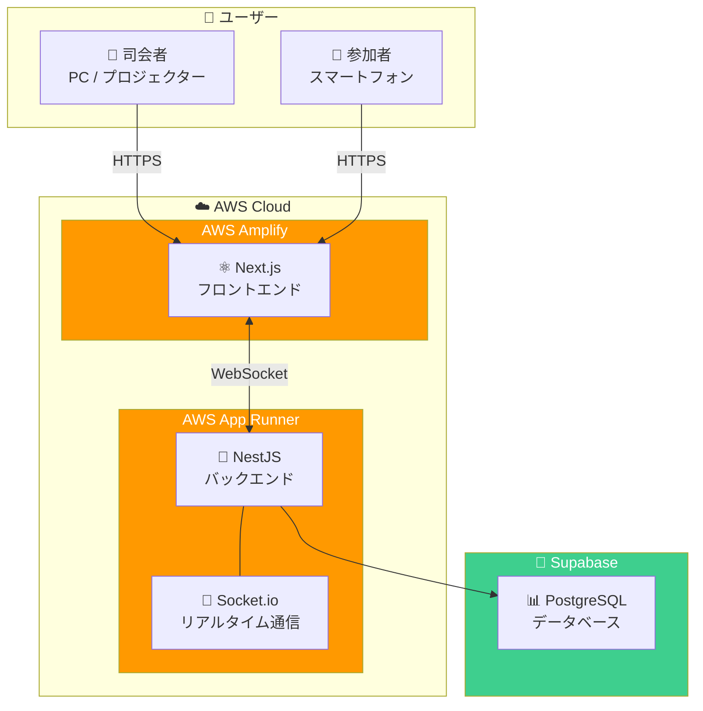
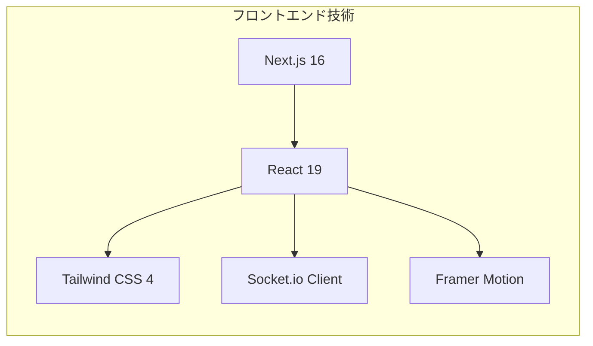
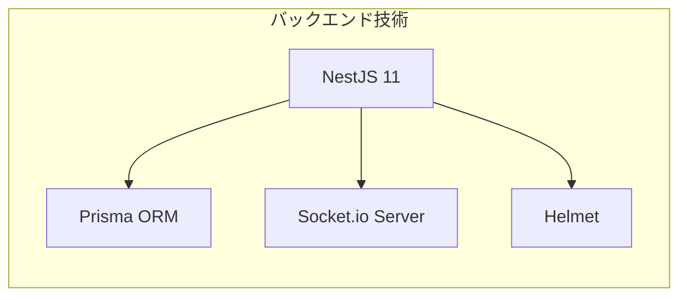
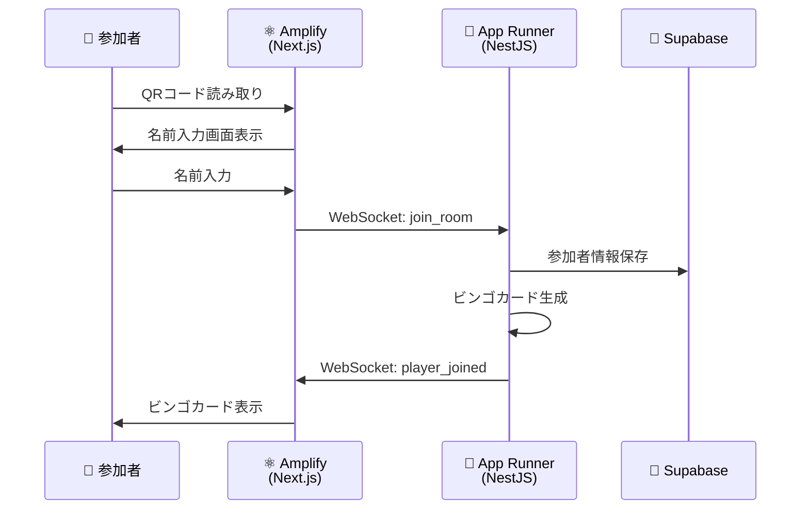
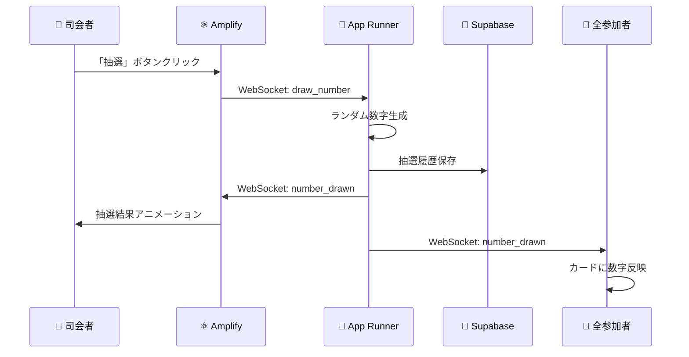
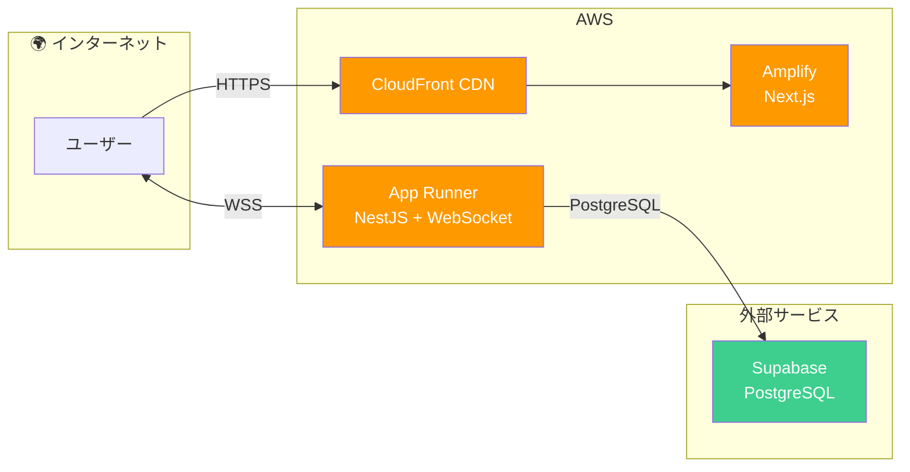
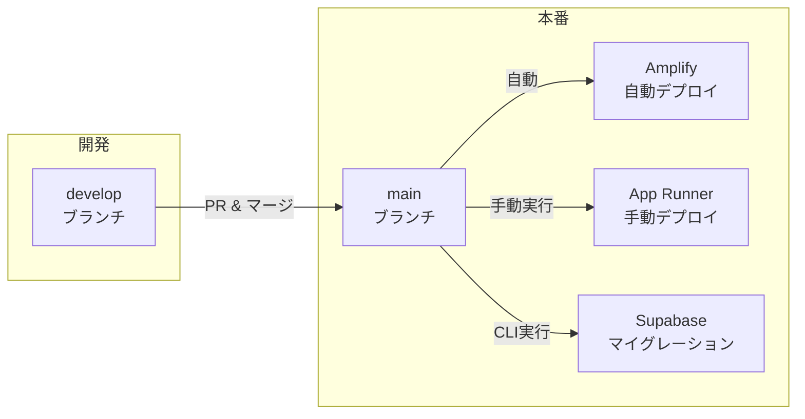

# 🎯 ビンゴアプリ システム構成図

> IT企業の忘年会向けリアルタイムビンゴアプリケーション

## 📋 概要

本アプリケーションは、イベント会場でのビンゴ大会をスムーズに運営するためのWebアプリケーションです。
参加者はスマートフォンでQRコードを読み取るだけで即座にゲームに参加でき、司会者はリアルタイムで抽選と参加者状況を管理できます。

---

## 🏗️ システムアーキテクチャ

### 全体構成図

---

## 🧩 技術スタック

### フロントエンド（Next.js on AWS Amplify）

| 技術 | バージョン | 用途 |
|-----|----------|------|
| **Next.js** | 16.0.3 | Reactフレームワーク（SSR対応） |
| **React** | 19.2.0 | UIコンポーネント |
| **Tailwind CSS** | 4.x | スタイリング |
| **Socket.io Client** | 4.8.1 | WebSocket通信 |
| **Framer Motion** | 12.x | アニメーション |
| **canvas-confetti** | 1.9.4 | ビンゴ演出（紙吹雪） |

---

### バックエンド（NestJS on AWS App Runner）

| 技術 | バージョン | 用途 |
|-----|----------|------|
| **NestJS** | 11.0.1 | Node.jsフレームワーク |
| **Prisma** | 6.19.0 | データベースORM |
| **Socket.io** | 4.8.1 | WebSocketサーバー |
| **Helmet** | 8.1.0 | セキュリティヘッダー |

---

### データベース（Supabase PostgreSQL）

| 項目 | 内容 |
|-----|------|
| **サービス** | Supabase |
| **エンジン** | PostgreSQL |
| **リージョン** | Tokyo (ap-northeast-1) |
| **用途** | ゲーム状態、参加者情報の永続化 |

---

## 🔄 データフロー

### ゲーム参加フロー

### 抽選フロー

---

## 🌐 インフラ構成詳細

### 通信経路

### 各コンポーネントの役割

| コンポーネント | サービス | 役割 |
|--------------|---------|------|
| **フロントエンド** | AWS Amplify | Next.jsアプリのホスティング、SSR、CDN配信 |
| **バックエンド** | AWS App Runner | APIサーバー、WebSocketサーバー |
| **データベース** | Supabase | PostgreSQLベースのBaaS |
| **リアルタイム通信** | Socket.io | 抽選結果・ビンゴ判定の即時同期 |

---

## 🎮 機能概要

### 司会者向け機能

- ✅ ゲーム作成・管理
- ✅ QRコード表示（参加者招待用）
- ✅ 数字抽選（アニメーション演出付き）
- ✅ 抽選履歴表示
- ✅ リアルタイム参加者状況（リーチ・ビンゴ人数）
- ✅ ビンゴ達成者リスト表示

### 参加者向け機能

- ✅ QRコードで即参加（ログイン不要）
- ✅ 自動生成ビンゴカード（5×5、中央FREE）
- ✅ タップで穴あけ
- ✅ リーチ・ビンゴ判定＆演出
- ✅ 途中参加・再接続対応

---

## 📊 想定規模

| 項目 | スペック |
|-----|---------|
| **同時参加者数** | ~100名 |
| **レスポンスタイム** | <100ms（WebSocket） |
| **可用性** | 99.9%（AWSマネージドサービス） |

---

## 🔐 セキュリティ

- **HTTPS/WSS**: 全通信を暗号化
- **Helmet**: セキュリティヘッダー設定
- **CORS設定**: 許可されたオリジンのみアクセス可能
- **UUIDルームID**: 推測困難なランダムID

---

## 🚀 デプロイ方式

| レイヤー | デプロイ方式 |
|---------|------------|
| **フロントエンド** | mainブランチへのマージで**自動デプロイ** |
| **バックエンド** | AWSコンソールから**手動デプロイ** |
| **データベース** | Prismaマイグレーションを**CLIから実行** |

---

## 📱 画面構成

| 画面 | URL | 対象 | 説明 |
|-----|-----|------|------|
| ホーム | `/` | 管理者 | ゲーム作成 |
| 管理画面 | `/admin` | 管理者 | ログイン・ゲーム一覧 |
| 司会画面 | `/host` | 司会者 | 抽選・進行管理 |
| 参加者画面 | `/play/{roomId}` | 参加者 | ビンゴカード |

---

## 📝 まとめ

本システムは、**Next.js + NestJS + Supabase** のモダンな3層アーキテクチャを採用し、
AWS Amplify と App Runner のフルマネージドサービスを活用することで、
運用負荷を最小限に抑えながら高可用性を実現しています。

**WebSocket (Socket.io)** によるリアルタイム通信で、
会場の全参加者に遅延なく抽選結果やビンゴ判定を配信し、
臨場感のあるビンゴ大会を演出します。

---

> 🎉 **忘年会を盛り上げましょう！**
